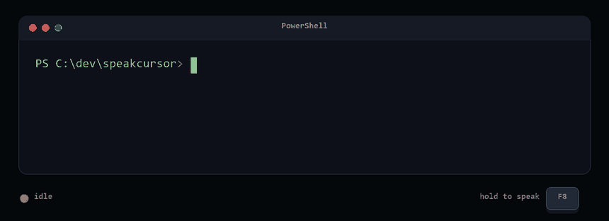

<div align="center">

# SpeakCursor

### Локальный голосовой ввод и push-to-talk диктовка для Windows

`Windows 10/11` &nbsp;·&nbsp; `Python` &nbsp;·&nbsp; `Whisper / faster-whisper` &nbsp;·&nbsp; `Системный трей`

[Быстрый старт](#быстрый-старт) · [Возможности](#возможности) · [Умная диктовка](#умная-диктовка) · [Приватность](#приватность) · [Сборка exe](#сборка-exe)

</div>

<p align="center">
  
</p>

<p align="center">
  <sub>16 секунд, превью без звука — <a href="assets/demo.mp4">полная версия со звуком</a></sub>
</p>

> **Говорите — и продолжайте работать.** SpeakCursor — приложение голосового ввода для Windows: речь превращается в текст прямо в активном поле. Локальное распознавание Whisper работает без интернета; постобработка через GPT подключается только по желанию.

[English version](README.md)

## Возможности

| Возможность                     | Как работает                                                                          |
| ------------------------------- | ------------------------------------------------------------------------------------- |
| **F8 — диктовка**               | Удержать, проговорить, отпустить: распознать, при необходимости исправить и вставить  |
| **Shift + F8 — умная диктовка** | Превратить поток мыслей в структурированный Markdown: ТЗ, заметку или черновик README |
| **Локально по умолчанию**       | Whisper распознаёт речь на компьютере, интернет не нужен                              |
| **Там, где вы печатаете**       | Вставляет текст в приложения и терминалы, затем возвращает прошлый буфер обмена       |
| **Живёт в трее**                | Статус записи и обработки, настройки, автозапуск и последние 20 расшифровок           |

Окон у приложения нет — только иконка в трее и диалог настроек.

## Умная диктовка

Главное отличие от других утилит на Whisper. Удерживаете Shift+F8, рассуждаете вслух — и вместо
сплошного потока получаете готовый документ.

Вы говорите:

> ну то есть нам нужен экран настроек где пользователь может вписать апи ключ и ещё выбрать
> модель и там же поле для горячей клавиши и чтобы всё сохранялось автоматически ну и галка
> автозапуска тоже

Получаете:

```markdown
## Экран настроек

- Поле для API-ключа
- Выбор модели
- Поле для горячей клавиши
- Галка автозапуска

Настройки сохраняются автоматически.
```

## Требования

- Windows 10/11, Python 3.12
- Микрофон
- Видеокарта NVIDIA — желательно, но не обязательна

С видеокартой (проверено на RTX 5070 Ti) модель `large-v3` распознаёт ~11 секунд речи за
секунду. Без видеокарты приложение работает на CPU, но `large-v3` будет ощутимо медленным —
выберите в настройках модель поменьше (`small` или `base`).

## Быстрый старт

```powershell
git clone https://github.com/VllSunday/speakcursor.git
cd speakcursor
python -m venv .venv
.venv\Scripts\pip install -r requirements.txt
.venv\Scripts\pythonw.exe main.py
```

При первом запуске скачивается модель Whisper (`large-v3` — около 3 ГБ) в кэш HuggingFace.
Пока она грузится, иконка в трее уже есть, но распознавание начнёт работать через ~15 секунд.

## Приватность

Если API-ключа нет или галка «Обрабатывать текст через GPT» снята, вставляется чистый результат Whisper и никакие расшифровки не уходят с компьютера.

## Постобработка через GPT (по желанию)

После распознавания текст можно прогнать через OpenAI, чтобы поправить пунктуацию и неверно
распознанные технические термины (Whisper любит выдавать «УИСПЕР» вместо «Whisper»).

Вставьте ключ в Настройках или задайте переменную окружения `OPENAI_API_KEY`. Модель выбирается
там же (`gpt-5-nano`, `gpt-5-mini`, `gpt-4.1-mini`, `gpt-4o-mini` или любая другая — поле
редактируемое). Расход на одну диктовку минимальный.

Если ключа нет или галка «Обрабатывать текст через GPT» снята, вставляется чистый результат
Whisper и никакие запросы наружу не уходят.

## Права администратора

Если вы диктуете в окно, запущенное от имени администратора (например, терминал Warp с
правами админа, редактор реестра, диспетчер задач), то утилита тоже должна работать с правами
администратора. Windows (механизм UIPI) запрещает обычному процессу отправлять ввод в
привилегированные окна — текст просто не вставится.

Галка «Запускать вместе с Windows» создаёт задачу в Планировщике с наивысшими правами: она
стартует при входе в систему молча, без запроса UAC. Чтобы её создать, включите галку,
запустив приложение от имени администратора.

Если привилегированными окнами вы не пользуетесь, обычного запуска достаточно.

## Вставка текста

По умолчанию режим «Авто»: в терминалах (Warp, Windows Terminal, cmd, PowerShell, WezTerm,
Alacritty…) используется Ctrl+Shift+V, потому что Ctrl+V там занят самим терминалом, а в
остальных приложениях — обычный Ctrl+V. Содержимое буфера обмена сохраняется и
восстанавливается после вставки.

Если попалось приложение, которое не понимает ни одну комбинацию, в настройках есть режим
«Печатать текст» — он эмулирует набор с клавиатуры, работает везде и не трогает буфер вообще,
но для длинных текстов заметно медленнее.

## Освобождение памяти в простое

Модель `large-v3` держит около 3 ГБ видеопамяти всё время, пока приложение висит в трее, — это
мешает, когда видеокарта нужна под другую задачу. Настройка «Выгружать модель из памяти»
освобождает её после 5, 10 или 15 минут без диктовки. По умолчанию стоит «Никогда» — модель
остаётся загруженной.

Плата за это: первая диктовка после выгрузки займёт на несколько секунд больше — модель заново
читается с диска. Дальше всё работает с обычной скоростью.

## Сборка .exe

```powershell
.venv\Scripts\pip install pyinstaller
.venv\Scripts\pyinstaller build.spec
```

Готовый `dist\VoiceInput\VoiceInput.exe` запускается без консоли. Сборка весит около 3 ГБ —
почти всё это библиотеки CUDA (cuDNN и cuBLAS).

## Где лежат данные

`%APPDATA%\VoiceInput\` — настройки (`settings.json`), история (`history.json`) и лог ошибок
(`error.log`). В репозиторий они не попадают.

## Из чего состоит

| Файл                 | Назначение                               |
| -------------------- | ---------------------------------------- |
| `main.py`            | точка входа, связывает всё вместе        |
| `tray.py`            | иконка в трее, меню, диалог настроек     |
| `hotkeys.py`         | удержание горячей клавиши                |
| `audio.py`           | запись с микрофона                       |
| `whisper_service.py` | локальное распознавание (faster-whisper) |
| `gpt_formatter.py`   | постобработка текста через OpenAI        |
| `clipboard.py`       | вставка в активное окно                  |
| `settings.py`        | настройки и автозапуск                   |
| `history.py`         | последние 20 распознаваний               |
